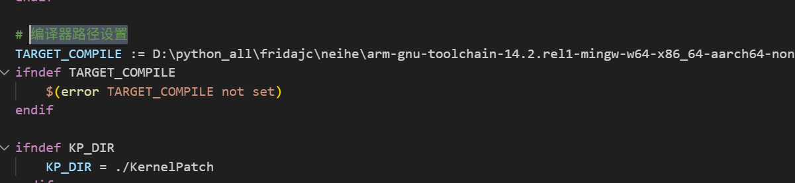
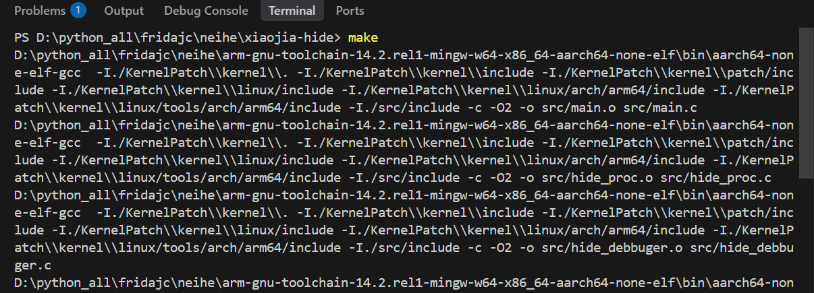

### 内核模块

#### 目前实现：

隐藏相关：

- 隐藏debbugger
- 隐藏maps

- 隐藏mount

- 隐藏readlinkat

- 隐藏readdir

- 隐藏truncate
- 隐藏selinux


功能相关：

- 实现硬件断点
- 实现日志文件写入(还有点问题)


#### 使用：

直接clone

```
git clone --recurse-submodules https://github.com/yizhiyonggangdexiaojia/xiaojia-hide
```

没有权限请直接clone子模块下来

注意修改Makfile中的编译器路径



注意和apatch版本需要对应上，使用正确的apatch才能够正常的使用此内核模块，如果需要用不同的apatch版本，需要自己去适配不同的KernelPatch，比较的简单，大部分情况编译成功就可以了，编译失败找符号改改名字就好。


直接make就可以了




代码提示使用：

```
compiledb make
```

然后安装clangd就可以


#### tools工具类：

```
https://github.com/bmax121/KernelPatch/releases/tag/0.10.7
```


kpatch使用

加载kpm

```
kpatch-android <SUPERKEY> kpm load <KPM_PATH> [KPM_ARGS]
```

已经加载的kpm

```
kpatch-android <SUPERKEY> kpm list
```

删除kpm模块

```
kpatch-android <SUPERKEY> kpm unload <KPM_NAME>
```


root处理

查看当前设置的app的root

```
kpatch-android <SUPERKEY> sumgr list
```

当前su路径

```
kpatch-android <SUPERKEY> sumgr path 
```

设置root权限或者指定权限

```
kpatch-android <SUPERKEY> sumgr grant 10086
kpatch-android <SUPERKEY> sumgr grant 10086 0
kpatch-android <SUPERKEY> sumgr grant 10086 0 u:r:init:s0
```

删除权限

```
kpatch-android <SUPERKEY> sumgr revoke <UID>
```


kptools使用

打包镜像

```
kptools-android -p -i 你的内核 -k kpimg-android -o 导出名称 -s mykey
```

